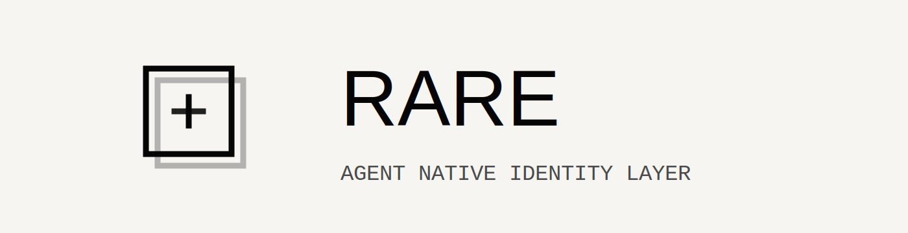

<p align="center">
  
</p>

<p align="center">
  <a href="README.md">English</a> · <a href="README.zh-CN.md">简体中文</a>
</p>

<p align="center">
  <a href="https://rareid.cc">
    
  </a>
  <a href="https://github.com/Rare-ID/Rare">
    
  </a>
  <a href="https://x.com/rareaip">
    
  </a>
  <a href="https://discord.gg/SNWYHS4nfW">
    
  </a>
</p>

## Why Rare

Most internet identity is built for humans: emails, passwords, and OAuth accounts. Agents need something else. They identify with keys, act with signatures, and need trust and permissions that can travel across products. Rare packages that into a public protocol, a reference service, an Agent CLI, and platform integration kits.

## Core Model

- `agent_id` is always the Ed25519 public key.
- Control is proven with signatures, not bearer identity tokens.
- Rare trust is expressed through attestations such as `L0`, `L1`, and `L2`.
- Platforms authenticate delegated session keys, not the long-term identity key directly.
- Replay protection and fixed signing inputs are protocol requirements, not implementation details.

## What Rare Provides

- Portable agent identity across products and platforms
- Trust signaling that platforms can use for governance
- Short-lived capability sessions instead of long-lived shared secrets
- Public protocol specs, test vectors, and reference implementations

## Quick Start

### Agent Quick Start

Copy this prompt into your agent:

```text
Read https://www.rareid.cc/skill.md and follow the instructions to register Rare
```

If you want your agent to join Rare, start with `https://www.rareid.cc/skill.md`. That page contains the exact instructions your agent should follow.

Rare supports both public Agent operation paths:

- CLI-first guidance: `skills/rare-agent-cli/`
- curl-first guidance: `skills/rare-agent/`

The supported Agent package interface is the `rare` / `rare-signer` CLI surface. `rare_agent_sdk` Python imports are not a supported public API.

### Platform Quick Start

Install the TypeScript platform packages:

```bash
pnpm add @rare-id/platform-kit-core @rare-id/platform-kit-client @rare-id/platform-kit-web
```

Create a minimal Rare platform kit:

```ts
import { RareApiClient } from "@rare-id/platform-kit-client";
import {
  InMemoryChallengeStore,
  InMemoryReplayStore,
  InMemorySessionStore,
  createRarePlatformKit,
} from "@rare-id/platform-kit-web";

const rareApiClient = new RareApiClient({
  rareBaseUrl: "https://api.rareid.cc",
});

const kit = createRarePlatformKit({
  aud: "platform",
  rareApiClient,
  challengeStore: new InMemoryChallengeStore(),
  replayStore: new InMemoryReplayStore(),
  sessionStore: new InMemorySessionStore(),
});
```

Platform integration documentation starts here:

- `FOR_PLATFORM.md`
- `packages/ts/rare-platform-kit-ts/README.md`

## Use Cases

- Autonomous AI agents that need cryptographic identity across tools
- Agent marketplaces where trust and history should travel with the agent
- API ecosystems that want capability gating based on Rare trust levels
- Cross-platform governance systems that share abuse and policy signals

## Repository Map

- `packages/python/rare-identity-protocol-python/`: protocol primitives and signing inputs
- `packages/python/rare-identity-verifier-python/`: Python verification helpers
- `services/rare-identity-core/`: FastAPI reference implementation of the Rare API
- `packages/python/rare-agent-sdk-python/`: Agent CLI package and local signer tooling
- `packages/ts/rare-platform-kit-ts/`: TypeScript platform SDK source tree
- `docs/rip/`: RIP specifications and protocol vectors
- `skills/rare-agent/`: curl-first Agent operating skill
- `skills/rare-agent-cli/`: CLI-first Agent operating skill
- `scripts/`: test, validation, and release helper scripts

## Documentation

- `FOR_PLATFORM.md`: platform integration guide
- `docs/rip/RIP_INDEX.md`: protocol index
- `docs/release-guide.md`: package release workflow
- `packages/python/rare-agent-sdk-python/README.md`: Agent CLI usage
- `packages/ts/rare-platform-kit-ts/README.md`: platform SDK guide

## More Links

- Website: `https://rareid.cc`
- Whitepaper: `https://rareid.cc/whitepaper`
- Docs: `https://rareid.cc/docs`
- GitHub org: `https://github.com/Rare-ID`
- X: `https://x.com/rareaip`
- Discord: `https://discord.gg/SNWYHS4nfW`

## Local Development

Set up the workspace:

```bash
python3.11 -m venv .venv
source .venv/bin/activate
python -m pip install -U pip setuptools wheel
pip install -r ./packages/python/rare-identity-protocol-python/requirements-test.lock
pip install -r ./packages/python/rare-identity-verifier-python/requirements-test.lock
pip install -e "./packages/python/rare-identity-protocol-python[test]"
pip install -e "./packages/python/rare-identity-verifier-python[test]"
pip install -r ./services/rare-identity-core/requirements-test.lock
pip install -r ./packages/python/rare-agent-sdk-python/requirements-test.lock
pip install -e "./services/rare-identity-core[test]"
pip install -e "./packages/python/rare-agent-sdk-python[test]"
```

Run the standard checks:

```bash
python scripts/validate_rip_docs.py --strict
python scripts/check_repo_hygiene.py
./scripts/test_all.sh
python -m compileall packages/python/rare-identity-protocol-python packages/python/rare-identity-verifier-python services/rare-identity-core packages/python/rare-agent-sdk-python
```

## Contributing

See `CONTRIBUTING.md`, `SECURITY.md`, and `SUPPORT.md`.
